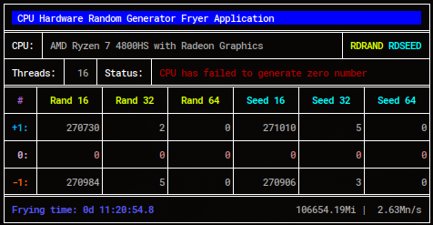

# Random Fryer: zero verify tool for x86-64 RNG units
<p align="center">
    
</p>
<p align="center">
    <i>Bottom fields: run length (blue), iterations counter | numbers per second</i>
</p>

---

#### Short history on AMD processor's RNG unit not being able to generate a 0

By accident, while testing a way to do graph in assembly to render and present data, and using the processor's builtin mechanism to generate random numbers (using 'rdrand' and 'rdseed' instructions) for introducing that data to be rendered, I've figured out that my AMD Ryzen 7  processor was completely and undeniably unable to generate the number zero in its unit, no matter what technique I was using. So, I ended up by using an alternate method to extract a zero from its random number generator, by "ANDing" (actually generating a 64-bit number and using only 16-bit number of that result) a bigger number to strip out a smaller one, in which result, it finally can be zero. And, later after, I've tested the same (non-AND) code on an Intel processor, and then zeroes were being generated with Intel. So, I did a quick program to count 0's generated using 'rdrand' and 'rdseed', and figured out the same.

This is why I've created this application, which is a second and more polished version of my first RNG test for zero program.

Its usage is quite simple, just run it from the terminal, and wait for the results to be shown at command line screen, in a table for easy reading. As an added benefit, I also included code to count 1's and -1's as well.

## How it works?

It presents itself to the user, and shortly then, starts running 2 threads to extract, as much as possible, numbers from hardware random number generator and counting 0, 1 and -1 occurences, in 16, 32 and 64 bit sizes. And the main thread periodically renders the result to screen, including the number of successful iterations with the RNG unit. After detecting a zero, or after some iterations that not result in any zero being generated, a status message is shown at the screen, with either a success or failure result accordingly.

Those 2 threads I've mentioned run at full speed to extract the maximum data as possible. They use a technique to lower the power consumption from CPUs they are using, but still they're 100% CPU usage threads anyway. Keep in mind that this is normal for this application so far.

## Installation

Just copy the executable to either your O.S. default binary path (usually '/usr/bin') as root (super user), or use it from any folder by typing './random-fryer' at command line from that folder. It doesn't need elevated privileges to run.

## Usage

This program has 2 command line options:

Just launch it default, "frying mode", with all explaining messages being shown:
```
 > random-fryer
```

Jump straight to test mode:
```
 > random-fryer -quick
```
or
```
 > random-fryer -q
```

Run in lightweight mode, which reduces CPU usage, but also reduces overall gathered numbers per second:
```
 > random-fryer -light
```
or
```
 > random-fryer -l
```

Also, it can be combined for both functionality:
```
 > random-fryer -ql
 > random-fryer -lq
 > random-fryer -quick -light
```
And so on...

Any other attempt at command line options will raise the help text and exit.

## Requirements

This program needs:

 - A Linux O.S. with glibc properly installed;
 - An x86-64 processor, which supports 'rdrand' and optionally 'rdseed' instructions (2015+ processors I guess).
 
## Build from source

I don't think anyone needs to build it (I provide the binary here), but, if one wants to do it, you will need:

 - [fasm2](https://github.com/tgrysztar/fasm2 "flat assembler 2") assembler;
 - [fastcall_v1](https://github.com/Jesse-6/fastcall_v1 "C style fastcall macro toolkit - for fasm2 assember") macro kit;

 
From the source folder, after having both properly set up, just run:
```
 > fasm2 random-fryer.asm ../random-fryer
```
And, as mentioned, copy the generated binary file to the folder you're planning to use it.

